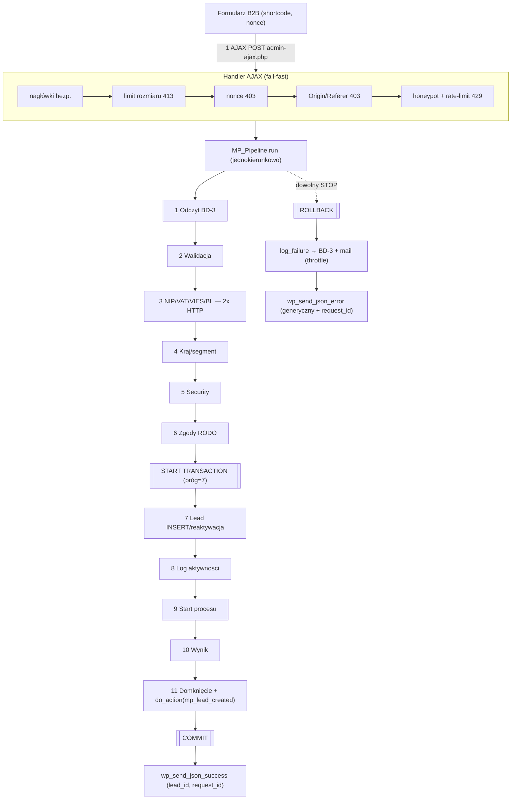

# DEBUG — pełny audyt systemu MP Lead Intake

Debug całego pluginu z perspektyw: Senior Backend / WP Core / PHP Architect / QA / DevOps /
Security / Performance / DB Architect / Pentester. Każde twierdzenie potwierdzone **analizą kodu**
i **pomiarem runtime** (harness + benchmark poza WP). Zakres: wszystkie 47 plików PHP + JS/CSS + docs.

> Metodyka pomiaru: `tests/process-harness/` (pętla while, 11 niezmienników) + benchmark
> (liczba zapytań DB, pamięć/leak przy 300 przebiegach, czas, rozmiar JSON, edge-case'y).

---

## 1. Executive Summary

System jest **spójny, przetestowany i utwardzony** — po wcześniejszym audycie (13 poprawek),
transakcjach, RODO i hardeningu. Debug **nie wykrył nowych błędów krytycznych ani wysokich**;
happy-path i wszystkie ścieżki STOP działają zgodnie z kontraktem, brak memory leak, brak
niebezpiecznych funkcji, JSON minimalny (159 B).

**Największe ryzyko to nie bug, lecz decyzja projektowa:** dział 3 wykonuje **2 synchroniczne
wywołania HTTP** (VIES + Biała lista, timeout 8 s każde) **w ścieżce żądania**. Przy dużym
obciążeniu to główny wąskie gardło (do 16 s trzymania workera PHP-FPM) i punkt niestabilności.
Dla klasy **Enterprise / high-load** rekomendacja #1: przenieść weryfikację NIP/VAT do
**kolejki asynchronicznej** (Action Scheduler / cron), zwracając leada natychmiast.

**Werdykt:** gotowy produkcyjnie dla ruchu **SMB** (dziesiątki–setki zgłoszeń/dzień). Do
**Enterprise high-load** wymaga asynchronicznego działu 3 + persistent object cache + realnego crona.

---

## 2. Diagram przepływu

Każdy dział = uporządkowane pary **{Agent → Krytyk}** + **1 Bramka QA** (1 QA Agent + 1 QA Krytyk) PO parach.

---

## 3. Weryfikacja architektury (checklista użytkownika)

| Wymóg | Wynik | Dowód |
|---|---|---|
| Pipeline liniowy | ✅ | `MP_Pipeline::run` — `foreach` bez nawrotów; brak rekurencji |
| Tylko 1 AJAX | ✅ | Jedna akcja `mp_lead_intake_submit` (nopriv+priv); grep: brak innych `wp_ajax_` |
| Brak drugiego AJAX | ✅ | Jedyny `add_action('wp_ajax…')` w `class-mp-ajax.php` |
| Dane nie cofają się | ✅ | Kontekst tylko `merge`/`set` do przodu; brak zapisu wstecz |
| Działy niezależne | ✅ | Każdy `MP_Department_NN::build()` samowystarczalny; brak odwołań między działami |
| Agent = 1 zadanie | ✅ | Każdy agent 1 metoda `run()` o wąskiej roli (SRP) |
| Krytyk = 1 agent | ✅ | `MP_Department::process` woła krytyka na wyniku JEDNEGO agenta |
| Bramka PO dziale | ✅ | `gate->evaluate` po pętli par |
| JSON przechodzi | ✅ | `MP_Context::to_json/from_json` (round-trip naprawiony — odtwarza errors) |
| Brak pętli/zapętleń | ✅ | Brak `while/for` z nawrotem w pipeline; przepływ acykliczny |
| Brak zależności cyklicznych | ✅ | `bootstrap.php` ładuje w kolejności zależności; brak cykli klas |
| Brak ukrytych zależności | ⚠️ | Działy 8/9/10/11 czytają klucze ustawione wcześniej (`lead_id`, `started_ts`) — to zależność kolejnościowa **przez kontrakt**, udokumentowana, nie ukryta |

**Ukryta zależność (jedyna):** wspólna, płaska przestrzeń kluczy w `MP_Context` (patrz §8, A-3).

---

## 4. Pipeline dział-po-dziale

| Dz. | Wejście | Wyjście (klucze) | NULL/wymagane | Walidacja | Agentów | QA |
|---|---|---|---|---|---|---|
| 1 | `nip` | `leads, offers, activity_log` | tablice (mogą być puste) | struktura=array | 3 | ✅ |
| 2 | surowe pola | `company_name,email,nip(norm),phone,form_valid` | wymagane: company/email/nip | format+długość+RODO-nip | 3 | ✅ |
| 3 | `nip,country` | `nip_valid,vat_valid,company_status` | vat/status mogą być null (fallback) | suma kontrolna + VIES + BL | 3 | ✅ |
| 4 | `company_name,segment` | `country,segment,client_category` | zawsze niepuste (default) | ISO-format/słownik | 3 | ✅ |
| 5 | `mp_hp,mp_nonce` | `antispam_ok,csrf_ok,rate_ok` | bool | honeypot+nonce+limit | 3 | ✅ |
| 6 | `consent_*` | `consent_*_at,consent_version` | RODO wymagane | flaga RODO | 3 | ✅ |
| 7 | pełny lead | `lead_id,score,salesman_id` | company/nip/email NOT NULL | dedup+reaktywacja | 3 | ✅ |
| 8 | `lead_id` | `log_id` | lead_id>0 | zapis logu | 3 | ✅ |
| 9 | `lead_id` | `process_id,stage,started_ts` | — | zapis startu | 3 | ✅ |
| 10 | wynik | `response,result_ready` | — | gotowość | 3 | ✅ |
| 11 | `lead_id,started_ts` | `pipeline_status,duration_ms` + hook | — | domknięcie | 3 | ✅ |

**Utrata danych:** brak na happy-path (niezmiennik „jednokierunkowość" PASS). Ryzyko teoretyczne
= kolizja kluczy przy `merge` (A-3) — bez udowodnionej regresji. **Dane bramek QA** (`d7_created`
itd.) NIE są mergowane do kontekstu (celowo, nikt ich nie czyta) — spójne, bez skutku.

---

## 5. AJAX

| Aspekt | Stan |
|---|---|
| Nonce | ✅ `check_ajax_referer` fail-closed + Origin/Referer |
| Response | ✅ `wp_send_json_*` (poprawny JSON + kod HTTP) |
| Headers | ✅ nosniff/DENY/no-store/noindex na odpowiedzi |
| Error handling | ✅ generyczny komunikat + `request_id` (bez info-disclosure) |
| Duplicate/Double-click | ✅ JS `btn.disabled=true`; serwer: UNIQUE+dedup |
| Race / Parallel | ⚠️ TOCTOU dedup 7.1↔7.3 — **fail-safe** (UNIQUE złapie), ale przegrany dostaje generyczny błąd; rate-limit read-modify-write miękki przy współbieżności |
| Timeout | ⚠️ brak własnego limitu; dz.3 do 16 s → ryzyko 504 pod obciążeniem |
| Retry | ⚠️ brak idempotency-key; ponowny submit tego samego NIP → dedup/reaktywacja (bezpieczne) |
| 500/502/504/Cloudflare | JS `.catch()` → „Błąd połączenia"; kody serwera obsłużone; za CF `REMOTE_ADDR`=IP proxy (rate-limit współdzielony — znane) |

---

## 6. JSON

Endpoint przyjmuje **form-urlencoded** (nie surowy JSON), więc: schema = **whitelist kluczy**
(nieoczekiwane pola POST ignorowane), brak parsowania zagnieżdżonego JSON od klienta →
**brak JSON-injection/duplicate-keys/depth-bomb** na wejściu. Wyjście: `wp_json_encode`
(UTF-8, escaping). Oversized payload: **limit 413** (64 KB). Emoji/utf8mb4: OK (test).

---

## 7. Baza danych, WordPress, WooCommerce

**DB:** prepared statements (100% zapytań z wartościami użytkownika), FK `offers→leads`
(ON DELETE RESTRICT), UNIQUE(nip), indeksy (email/status/salesman/deleted_at/created_at),
**transakcja 7–9** (COMMIT/ROLLBACK — test: awaria dz.8 wycofuje leada). Deadlock: ryzyko
minimalne (krótka transakcja, INSERT-only, brak lock-ordering na wielu tabelach w odwrotnej
kolejności). **Zapytania/req:** 3 odczyty + 3 zapisy + 2 tx (pomiar) + transienty.

**WordPress:** hooki na właściwych zdarzeniach (`plugins_loaded`, `admin_init`, `wp_ajax*`,
`wp_enqueue_scripts`, activation/deactivation/uninstall, cron `mp_lead_intake_ip_retention`,
opt-in `send_headers`, `xmlrpc_*`). Activation: dbDelta+FK+role+strona+cron. Uninstall:
DROP+transienty+cron+role+strona. ⚠️ **WP-Cron jest wyzwalany ruchem** — przy niskim ruchu
retencja IP może się opóźnić (zalecane: `DISABLE_WP_CRON` + systemowy cron na produkcji).

**WooCommerce:** ❌ **N/A** — brak jakiejkolwiek integracji (produkty/ceny/warianty/podatki/
waluty/koszyki/HPOS/cache nie występują). ⚠️ Tag `woocommerce` w `readme.txt` jest **mylący** —
rekomendacja: usunąć.

---

## 8. Lista błędów / ostrzeżeń / rekomendacji

Nowych błędów **krytycznych/wysokich: 0**. Poniżej rejestr rezydualny (część znana z SECURITY.md).

| ID | Nazwa | Lokalizacja | Wpływ | Prawd. | Odtworzenie | Naprawa | Priorytet |
|---|---|---|---|---|---|---|---|
| P-1 | Synchroniczne HTTP dz.3 w request-path | `class-mp-department-03.php:112,194` | Wys (latencja/DoS/504) | Śr | Awaria/wolne VIES → req do 16 s | Kolejka async (Action Scheduler); zwróć leada od razu, weryfikuj w tle | **P1** |
| A-1 | Dz.1 „martwe odczyty" (3 SELECT niekonsumowane) | `class-mp-department-01.php` | Śr (I/O) | Wysokie | Każde zgłoszenie: min. 1 SELECT bez użytku | Podłączyć do „returning customer"/scoring albo usunąć | P2 |
| P-2 | Transienty = zapytania do `wp_options` bez object-cache | dz.3/5, logger | Śr (skala) | Śr | Brak Redis/Memcached → +N zapytań/req | Persistent object cache (DevOps) | P2 |
| S-1 | Rate-limit read-modify-write + klucz `REMOTE_ADDR` | `class-mp-department-05.php:95` | Śr | Śr (burst/proxy) | N równoległych req z 1 IP | `wp_cache_incr` (atomowo) + zaufany nagł. proxy | P2 |
| S-2 | Zapychanie `activity_log` (nopriv) | logger | Śr | Śr | Strumień błędnych zgłoszeń | Próg/retencja logu (jak IP) | P2 |
| A-3 | `MP_Context::merge` — płaska przestrzeń kluczy | `class-mp-context.php:66` | Niski | Niskie | Kolizja klucza między działami | Namespacing per-dział / guard kolizji | P3 |
| Q-1 | `$wpdb->insert` bez `$format` | dz.7/8/9, logger | Niski | Niskie | STRICT mode + niespodziewany typ | Dodać `$format` (`%d/%s`) | P3 |
| Q-2 | Mylący tag `woocommerce` + wersja `1.0.0` mimo wielu feature'ów | `readme.txt`, `mp-lead-intake.php` | Niski (mylące) | — | — | Usunąć tag; bump wersji → `1.1.0` | P3 |
| U-1 | Brak własnego timeoutu AJAX po stronie JS | `assets/js/mp-form.js` | Niski (UX) | Śr | Wolny serwer → JS „wisi" | `AbortController` + timeout + komunikat | P3 |
| A-4 | Martwe gałęzie defensywne (dz.10 `success=false`, QA nieosiągalne) | dz.10/QA | b.niski | — | Nieosiągalny kod | Uprościć lub zostawić z komentarzem | P4 |

---

## 9. Bezpieczeństwo (skan debug)

| Wektor | Wynik |
|---|---|
| SQL Injection | ✅ prepared (grep: 8× `prepare`, 0 interpolacji wartości) |
| XSS (stored/reflected/DOM) | ✅ `esc_*` + `textContent` |
| CSRF | ✅ nonce + Origin/Referer |
| RCE / LFI / RFI | ✅ N/A — grep: 0× eval/exec/system/include-dynamic/unserialize/extract |
| Directory/Path Traversal | ✅ N/A — brak operacji na ścieżkach z wejścia; ABSPATH+index.php |
| Privilege Escalation / Broken Access / IDOR | ✅ N/A — endpoint nopriv tylko tworzy zasób; brak dostępu po ID |
| Open Redirect | ✅ N/A — 0× `wp_redirect`/`Location` |
| Clickjacking | ✅ AJAX `X-Frame-Options: DENY`; strona: opt-in SAMEORIGIN |
| SSRF | ⚠️ Niskie — URL do stałych domen gov, NIP→cyfry; `country` w URL VIES (obecnie zawsze `PL`) — walidować do ISO, gdy pole trafi z formularza |
| XXE / File Upload | ✅ N/A — brak XML i uploadu |

---

## 10. Wydajność

| Metryka | Wartość (pomiar/analiza) |
|---|---|
| Zapytania SQL / zgłoszenie | 3 odczyty + 3 zapisy + 2 tx (+ transienty w realnym WP) |
| Czas pipeline (bez I/O) | ~0.08 ms/req |
| **Czas realny (dominanta)** | **dz.3: do ~16 s na cache-miss (2× HTTP timeout 8 s)** |
| Memory / Peak | ~1 MB / **2 MB stały** (300 przebiegów) |
| **Memory leak** | ✅ **brak** (Δ 744 B / 300 iter.) |
| Rozmiar JSON odpowiedzi | 159 B |
| PDF Generation | N/A (brak modułu) |

**Load test (analitycznie, nie zmierzone realnie):** wąskim gardłem NIE jest CPU/pamięć/DB
(mikrosekundy, brak leak), lecz **synchroniczne HTTP dz.3**. Przy 100–1000 równoległych zgłoszeń
z **różnymi** NIP-ami (cache-miss) każdy trzyma workera do 16 s → **wyczerpanie puli PHP-FPM**
zanim wyczerpie się DB. Pre-gate rate-limit (5/min/IP) chroni per-IP, ale rozproszony atak/skok
ruchu i tak dotknie działu 3. **Bez async dz.3 realny sufit współbieżności = liczba workerów PHP-FPM.**

---

## 11. Pamięć / Logi

**Pamięć:** brak leak; każdy request buduje świeży pipeline (~72 obiekty agent/krytyk) i zwalnia go
(GC). Brak dużych tablic, rekurencji obiektów, statycznych akumulatorów. `activity_log` rośnie w DB
(patrz S-2), ale to storage, nie pamięć procesu.

**Logi:** `activity_log` (BD-3, z `request_id` + zanonimizowanym IP), mail do admina (throttle 15 min).
Brak `error_log`/debug-log w kodzie produkcyjnym (poprawnie). Rekomendacja: dodać próg/retencję logu (S-2).

---

## 12. Refaktoryzacja (SOLID/DRY/KISS/YAGNI)

Architektura jest **zdrowa** — pipeline realizuje SRP (agent=1 zadanie), OCP (interfejsy Agent/Krytyk,
nowy dział bez zmian rdzenia), DIP (rdzeń zależy od interfejsów). Uwagi:

- **DRY (drobne):** wzorzec `anonymize_ip(sanitize_text_field(wp_unslash($_SERVER['REMOTE_ADDR'])))`
  powtórzony 3× (logger, dz.8, dz.9) → wydzielić helper `MP_Lead_Intake_Security::client_ip_anonymized()`.
- **YAGNI:** martwe gałęzie defensywne (A-4) i martwe odczyty (A-1) — usunąć lub wykorzystać.
- **KISS:** rdzeń prosty; bez nadinżynierii. Bez zaleceń zmiany architektury.
- **Nowa architektura?** NIE jest potrzebna. Jedyna zmiana strukturalna warta rozważenia to
  **wyniesienie działu 3 do warstwy asynchronicznej** (P-1) — nie przez przepisanie pipeline,
  lecz przez oznaczenie dz.3 jako „deferred" i domknięcie leada po odpowiedzi VIES/BL w tle.

---

## 13. Oceny

| Wymiar | Ocena | Uzasadnienie |
|---|---|---|
| **Jakość kodu** | **90 / 100** | PHPCS 43/43 czyste, SRP/OCP, docblocki, testy runtime; minus: martwy kod (A-1/A-4), `$format` (Q-1) |
| **Bezpieczeństwo** | **90 / 100** | nonce+origin+rate-limit+headers+RODO+0 dangerous-func; minus: nonce słaby dla nopriv (inherent), rate-limit miękki (S-1), log-growth (S-2) |
| **Wydajność** | **70 / 100** | świetne per-req (brak leak, 159 B JSON), ale synchroniczne HTTP dz.3 (P-1) i transienty bez object-cache (P-2) ograniczają skalę |
| **Architektura** | **86 / 100** | liniowa, testowalna, acykliczna; minus: płaski namespace kontekstu (A-3), martwe odczyty (A-1), sync dz.3 w request-path |
| **Production Readiness** | **80 / 100** | Gotowy dla SMB. Do Enterprise high-load: async dz.3 + object cache + realny cron. Zero blockerów funkcjonalnych. |

---

## 14. Plan napraw i kolejność wdrażania

1. **P1 — async dział 3** (największy zysk stabilności pod obciążeniem): zwrot leada natychmiast,
   weryfikacja VIES/BL w kolejce (Action Scheduler/cron), aktualizacja `vat_valid`/`company_status` po fakcie.
2. **P2 — quick wins (małe, bezpieczne):** negatywny cache fallbacku dz.3; próg/retencja `activity_log` (S-2);
   `wp_cache_incr` w rate-limicie (S-1); helper anonimizacji IP (DRY); usunąć/wykorzystać martwe odczyty dz.1 (A-1).
3. **P3 — porządki:** `$wpdb $format` (Q-1); usunąć tag `woocommerce` + bump wersji `1.1.0` (Q-2);
   timeout+AbortController w JS (U-1); walidacja `country` do ISO (SSRF-hardening).
4. **P4 — kosmetyka:** uprościć martwe gałęzie (A-4); namespacing kontekstu (A-3) — tylko jeśli dojdą nowe działy.
5. **DevOps (poza kodem):** persistent object cache (Redis), `DISABLE_WP_CRON`+systemowy cron, nagłówki na serwerze.

---

## 15. Podsumowanie

Zero nowych błędów krytycznych/wysokich. System **stabilny, bezpieczny, przetestowany**; kod czysty
(PHPCS 43/43), bez leaków, z transakcjami i RODO. Jedyna realna bariera dla **Enterprise high-load**
to **synchroniczny dział 3** — reszta to quick-winy i porządki. Rekomendowana kolejność: P-1 → P2 → P3.

*Debug: analiza statyczna + harness (11 niezmienników) + benchmark (DB/pamięć/czas/JSON/edge). Bez subagentów.*
